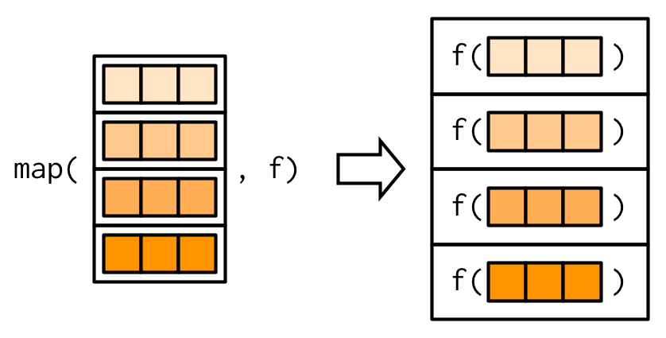

```{r setup, include=FALSE}
knitr::opts_chunk$set(echo = TRUE)
library(reticulate)
```

##  apply() function in R 

When you want to apply a function to the rows or columns of a matrix (and higher-dimensional analogues); not generally advisable for data frames as it will coerce to a matrix first.

### apply()


####  Description 

Returns a vector or array or list of values obtained by applying a function to margins of an array or matrix.

####  Usage  

apply(X, MARGIN, FUN, ..., simplify = TRUE)

#### Arguments  

* X  
an array, including a matrix.

* MARGIN	
a vector giving the subscripts which the function will be applied over. E.g., for a matrix 1 indicates rows, 2 indicates columns, c(1, 2) indicates rows and columns. Where X has named dimnames, it can be a character vector selecting dimension names.

* FUN	
the function to be applied: see ‘Details’. In the case of functions like +, %*%, etc., the function name must be backquoted or quoted.

* ...	
optional arguments to FUN.

* simplify	
a logical indicating whether results should be simplified if possible.

* na.rm = TRUE|FALSE

####  Examples  


Let

$$
\text{mat}=\left(
\begin{array}{ccc}
1 & 2 & 3 \\
4 & 5 & 6\\
7 & 8 & 9\\
10 & 11 & 12\\
\end{array}
\right).
$$


```{r}
mat<-matrix(1:12,byrow=T,ncol=3,nrow=4)
apply(X=mat, MARGIN=1, FUN=sum)
apply(X=mat, MARGIN=2, FUN=sum)
#Last, if you apply the function to each cell:
apply(X=mat, MARGIN=c(1,2), FUN=sum)
apply(X=mat, MARGIN=c(1,2), FUN=function(x) x^2)
#If you set MARGIN = c(2, 1) instead of c(1, 2) the output will be the same matrix #but transposed.
apply(X=mat, MARGIN=c(2,1), FUN=function(x) x^2)
```

You can set the MARGIN argument to c(1, 2) or, equivalently, to 1:2 to apply the function to each value of the matrix. Note that, in this case, the elements of the output are the elements of the matrix itself, as it is calculating the sum of each individual cell.


If you set MARGIN = c(2, 1) instead of c(1, 2) the output will be the same matrix but transposed.


```{r}
apply(mat, 2, range)   # Range (min and max values) by column

apply(mat, 1, summary) # Summary for each row

apply(mat, 2, summary) # Summary for each column
```

```{r}
mat<-matrix(1:9,byrow=T,ncol=3)
apply(X=mat, MARGIN=1, FUN=sum)==rowSums(mat)
apply(X=mat, MARGIN=2, FUN=sum)==colSums(mat)

```

```{r}
# Return the product of each of the rows
apply(X=mat,MARGIN=1,FUN=prod)
# Return the sum of each of the columns
apply(X=mat,MARGIN=2,FUN=min)

```

####  Applying a custom function 

* تابع یک بردار را می گیرد و یک عدد را بر می گرداند 

در این حالت خروجی یک بردار است

```{r}
# Return a new matrix whose entries are those of 'm' modulo 10
apply(mat,1,function(x) sum(x))== rowSums(mat)
# Return a new matrix whose entries are those of 'm' modulo 10
apply(mat,2,function(x) mean(x))== colMeans(mat)
```

* تایع یک بردار را می گیرد و یک بردار را بر می گرداند

در این حالت خروجی یک ماتریس است و بدرد مواردی می خورد که بخواهیم روی هر عنصر یک تابع خاص را اعمال کنیم.

در این حالت چه روی سطر چه روی ستون تابع اعمال شود تفاوتی ندارد

```{r}
# Return a new matrix whose entries are those of 'm' modulo 10
apply(mat,1,function(x) x%%2)
# Return a new matrix whose entries are those of 'm' modulo 10
apply(mat,2,function(x) x%%2)
```


####  Passing arguments to iterated function through apply  

Note the ... in the function definition:

```{r}
args(apply)
```
and the corresponding entry in the documentation:

...: optional arguments to ‘FUN’.


```{r}	
f1 <- function(x,v2){
  x+v2
}
apply(X=mat,MARGIN = c(1,2), FUN = f1,v2=1)
```
	


###  lapply()

lapply() function is useful for performing operations on list objects and returns a list object of same length of original set. lappy() returns a list of the similar length as input list object, each element of which is the result of applying FUN to the corresponding element of list. Lapply in R takes list, vector or data frame as input and gives output in list.


```{r}
#Example
#Sort the list alphabetically:
movies <- c("SPYDERMAN","BATMAN","VERTIGO","CHINATOWN")
movies_lower <-lapply(movies, tolower)
str(movies_lower)

```

```{r}
ls1<-list(a=1:3,b=rep(1:2,each=4),c=1:9)
lapply(ls1,length)
```

```{r}
ls1<-list(a=1:3,b=1:4,c=1:5)
lapply(ls1,cumsum)
```


#### Description 

lapply returns a list of the same length as X, each element of which is the result of applying FUN to the corresponding element of X.

####  Arguments 

* X	
a vector (atomic or list) or an expression object. Other objects (including classed objects) will be coerced by base::as.list.

* FUN	
the function to be applied to each element of X: see ‘Details’. In the case of functions like +, %*%, the function name must be backquoted or quoted.

* ...	
optional arguments to FUN.


####  Example 1 


```{r}
x <- list(a = 1:10, beta = exp(-3:3), logic = c(TRUE,FALSE,FALSE,TRUE))
lapply(x, mean)
```


####  Applying a custom function 

* تابع یک بردار را می گیرد و یک بردار را بر می گرداند
در این حالت فرمت و بعد خروجی با ورودی یکسان است

```{r}
x <- list(a = 1:10, b = 5:1)
lapply(x, function(x) x^2)
```


* تابع یک بردار را می گیرد و یک عدد را بر می گرداند
در این حالت به اندازه طول لیست، خروجی داریم. یعنی به ازای هر بردار در لیست مورد نظر یک خروجی خواهیم داشت

```{r}
x <- list(a = 1:10, b = 5:1)
lapply(x, function(x) sum(x))
```


```{r}
x <- list(a = 1:3, b = 1:4)
lapply(x, function(x) (min(x)+max(x))/2)
```


####  Passing arguments to iterated function through apply 

Note the … in the function definition:

```{r}
x <- list(a = 1:10, b = 5:1)
lapply(x, function(x,vr) vr+sum(x),vr=7)
```
```{r}
x <- list(a = 1:3, b = 4:1)
lapply(x, function(x,pow) x^pow,pow=2)
```

quantile(x, ...)


quantile(x, probs = seq(0, 1, 0.25), na.rm = FALSE,
         names = TRUE, type = 7, digits = 7, ...)


```{r}
x <- list(a = 1:10, beta = exp(-3:3), logic = c(TRUE,FALSE,FALSE,TRUE))
lapply(x, quantile, probs = (1:3)/4)
```


####  lapply vs for loop 

The lapply function can be used to avoid for loops, which are known to be slow in R when not used properly. Consider that you want to return a list containing the third power of the even numbers of a vector and the the fourth power of the odd numbers of that vector. In that case you could type:


```{r}
# Empty list with 5 elements
x <- vector("list", 5)

# Vector
vec <- 1:5

for(i in vec) {
    if(i %% 2 == 0) { # Check if the element 'i' is even or odd
        x[[i]] <- i ^ 3
    } else {
        x[[i]] <- i ^ 4
    }
}
x
```


An alternative is to use the lappy function as follows:


```{r}
vec <- 1:5
fun <- function(i) {
   if(i %% 2 == 0) {
        i ^ 3
   } else {
        i ^ 4
    }
}

lapply(vec, fun)
```
 You will only be able to use the lapply function instead of a for loop if you want to return a list of the same length as the vector or list you want to iterate with. 


####  Using lapply on certain columns of an R data frame 


Consider that you have a data frame and you want to multiply the elements of the first column by one, the elements of the second by two and so on.

On the one hand, for all columns you could write:

```{r}
df <- data.frame(x = c(6, 2), y = c(3, 6), z = c(2, 3))
df
# Function applied to all columns
lapply(1:ncol(df), function(i) df[, i] * i)
#or lapply(1:ncol(df), function(i,mat) mat[, i] * i,mat=df)
```


On the other hand, If you want to use the lapply function to certain columns of the data frame you could type:

```{r}
# Function applied to the first and third columns
lapply(c(1, 3), function(i) df[, i] * i)
```


####  Nested lapply functions 

If needed, you can nest multiply lapply functions. Consider that you want to iterate over the columns and rows of a data frame and apply a function to each cell. For that purpose, and supposing that you want to multiply each cell by four, you could type something like the following:


```{r}

df <- data.frame(x = c(6, 2), y = c(3, 6))

# Empty list
res <- vector("list", 2)

for(i in 1:ncol(df)) {
    for (j in 1:nrow(df)) {
        res[[j]][i] <- df[j, i] * 4
    }
}

res

```


You can get the same values nesting two lapply functions, applying a lapply inside the FUN argument of the first:

```{r}
lapply(1:ncol(df), function(i) {
       unlist(lapply(1:nrow(df), function(j) {
              df[j, i] * 4
       }))
})
```


```{r}
m<-matrix(0,2,3)
for(i in 1:2){ for(j in 1:3) m[i,j]<-i+j}
m

lapply(1:2, function(i) {lapply(1:3,function(j) i+j)})
```

The lapply and sapply functions are very similar, as the first is a wrapper of the second. The main difference between the functions is that lapply returns a list instead of an array. However, if you set simplify = FALSE to the sapply function both will return a list.

```{r}
sapply(1:2, function(i) {sapply(1:3,function(j) i+j)})

```

###  sapply()

```{r}
#Example
#Sort the list alphabetically:


```


###  vapply()

```{r}
#Example
#Sort the list alphabetically:


```


###  tapply()

```{r}
#Example
#Sort the list alphabetically:


```


###  mapply()

```{r}
#Example
#Sort the list alphabetically:


```


 


###  by()

```{r}
#Example
#Sort the list alphabetically:


```


 


 


###  replicate()

```{r}
#Example
#Sort the list alphabetically:


```


###  map()

The most fundamental functional is purrr::map()53. It takes a vector and a function, calls the function once for each element of the vector, and returns the results in a list. In other words, map(1:3, f) is equivalent to list(f(1), f(2), f(3)).

```{r}
#Example
#Sort the list alphabetically:
library(purrr)
triple <- function(x) 3*x 
map(1:3, triple)

```
<center>
{width=250px}
</center>


### map_chr()

```{r}
#Example
# map_chr() always returns a character vector
map_chr(mtcars, typeof)
```


### map_lgl()

```{r}
#Example
# map_lgl() always returns a logical vector
map_lgl(mtcars, is.double)


```

###  map_int()

```{r}
#Example
# map_int() always returns a integer vector
n_unique <- function(x) length(unique(x))
map_int(mtcars, n_unique)
```


### map_dbl() 

```{r}
#Example
# map_dbl() always returns a double vector
map_dbl(mtcars, mean)
```

<center>
{width=250px}
</center>


```{r}
#Example
map_dbl(mtcars, function(x) length(unique(x)))
```

```{r}
#Example
map_dbl(mtcars, ~ length(unique(.x)))

```
### Passing arguments with ...

It’s often convenient to pass along additional arguments to the function that you’re calling. For example, you might want to pass na.rm = TRUE along to mean(). One way to do that is with an anonymous function:


```{r}
#Example
x <- list(1:5, c(1:10, NA))
map_dbl(x, ~ mean(.x, na.rm = TRUE))
```

But because the map functions pass ... along, there’s a simpler form available:

```{r}
#Example
map_dbl(x, mean, na.rm = TRUE)
```


This is easiest to understand with a picture: any arguments that come after f in the call to map() are inserted after the data in individual calls to f():


<center>
{width=250px}
</center>


It’s important to note that these arguments are not decomposed; or said another way, map() is only vectorised over its first argument. If an argument after f is a vector, it will be passed along as is:


<center>
{width=250px}

</center>


```{r}
#Example
trims <- c(0, 0.1, 0.2, 0.5)
set.seed(1)
y <- rcauchy(1000)
map_dbl(trims, ~ mean(y, trim = .x))

```


## Contact us

Contact me at masoudfaridi@modares.ac.ir or masoud1faridi@gmail.com

